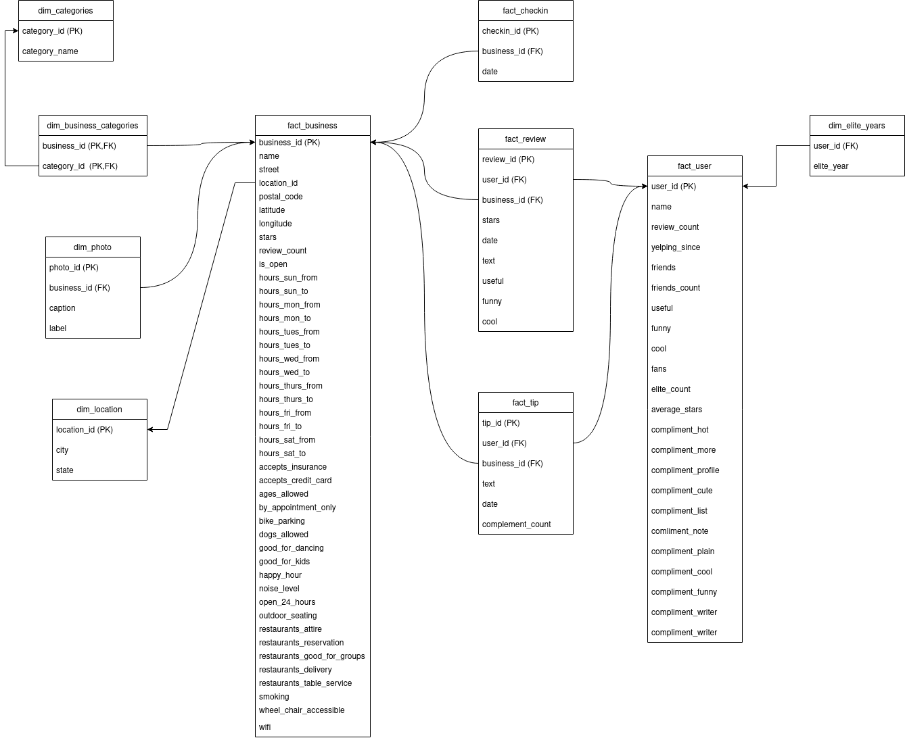
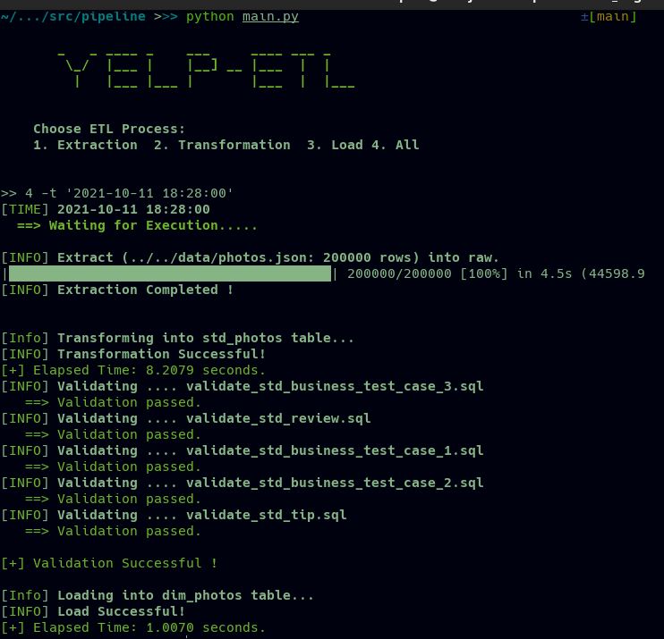

# Yelp-ETL

> #### The file structure of this repo:
```
data/                               # Folder containg link to Yelp Dataset.
  |_ *.txt 
docs/                               # Folder containing .md files for explanations.      
  |_ images/                        # Screenshots
  |_ *.md
schema/                             # Folder containing sql queries to creates db.
  |_ *.sql    
src/
  |_ pipeline/                      # Folder containing python scripts    
  |   |_ utils/                     # Folder containing utiliy modules.
  |   |_ *.py   
  |_ sql/                           # Folder containing DQL/DML.
      |_ procedures/                # Procedural queries   
      |_ queries/                   # SQL queries
      |_ validation_scripts/        # Validation queries
```


This is the complete ETL (Extract -> Transform -> Load) pipeline for Yelp Dataset.  


### Dataset: 

The [Yelp Dataset](https://www.yelp.com/dataset/documentation) is subset of Yelp's businesses, reviews, and user data, available for academic use. It contains 160585 business, 2189457 user, 8635403 reviews, 1162119 tip, 138876 checkin and 200000 photo data in json format. This data has been used for the ETL process in this repo. 


### DataModel:



This is the target model to achieve using the dataset.

### ETL: 
* **Extract** : The Extraction process is done using the [extract_raw_from_json.py](./src/pipeline/extract_raw_from_json.py) script.
* **Transform** : The Transformation process is done using the [transformation.py](./src/pipeline/transformation.py) script.
* **Load** : The Load process is done using the [load.py](./src/pipeline/load.py) script.

The [main.py](./src/pipeline/main.py) file helps to carry out this process according to our choice.



### Visualization :
The visualization for the data analysis and insights was done using **MicrosoftPowerBI**. 

> #### **The complete documentation is in [docs/](./docs) folder.**  