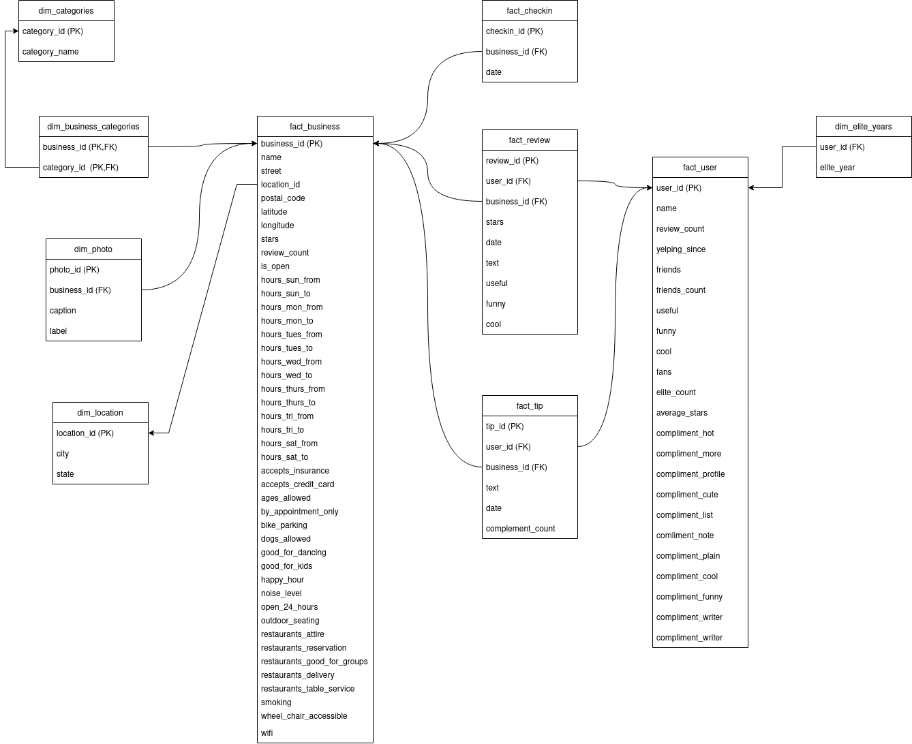

# Data Warehouse Design

## Logical Modeling :

> ## Business Requirements:
The Yelp Data comes under business domain. Some of its business requirements are:

* Analyze the review provided by user to businesses
* Get Insight about the business information and ratings 
* Get user information and their attributes

According to the requirements and dataset, the dimension and fact table can be: 

> ### Identifying Dimension Tables:
*  **dim_location** - location_id (PK) , city, state 
*  **dim_categories** - category_id (PK), category_name
*  **dim_business_categories**  - business_id , category_id
*  **dim_photos** - photo_id  ,business_id ,caption ,label 	
*  **dim_elite_years** - user_id ,elite_year
*  **dim_** - paycode_id, paycode

> ### Identifying Fact Tables:
* **fact_business** : This table contains the data related to business and its attributes.
* **fact_checkin** : This table contains info about the checkin date for business.
* **fact_review** : This table contains the data related to review given by user on different businesses.
* **fact_tip** : This table contains info about the tip provided by user to business.
* **fact_user** : This table contains the data related to user and their attributes.

The description of Entities, Attributes and their domain:

| **Entities**         | **Description**                         | **Domain** |
|----------------------|-----------------------------------------|------------|
|**dim_location**| Information on business city and state.     |            |
|
**Attributes :**

location_id

city

state

|

Identifier of entity, PK

Name of city

State

|

SERIAL

Text

Text

|
|**dim_categories**| Categories of business.     |            |
|
**Attributes :**

category_id

category_name

|

Identifier of entity, PK

Category Name

|

SERIAL

Text
|
|**dim_business_categories**| Relational table between Categories and business.     |            |
|
**Attributes :**

business_id

category-id

|

Identifier of entity fact_business

Identifier of entity dim_categories

|

Valid id from fact_business table

Valid id from dim_categories table
|
|**dim_photos**| Photo Infomation about business.   |            |
|
**Attributes :**

photo_id

business_id

caption
label
|

Identifier of entity

Valid id from fact_business table

Description of photo.

Label of photo
|
Text

Text

Text

Text
|
|**dim_elite_years**| Elite years of user.         |            |
|
**Attributes :**

user_id

elite_year
|

Valid id from fact_user

Elite year
|

Text

Text
|
|**fact_business**| Information about business.             |            |
|
**Attributes :**

business_id

name

street

location_id

postal_code

latitude
longitude 
 stars
 review_count 
is_open
 hours_sun_from
 hours_sun_to
 hours_mon_from 
hours_mon_to 
hours_tues_from
 hours_tues_to 
hours_wed_from 
 hours_wed_to
 hours_thurs_from 
hours_thurs_to 
     hours_fri_from   
   hours_fri_to
        hours_sat_from 
     hours_sat_to    
    accepts_insurance 
  accepts_credit_card
 ages_allowed 
       by_appointment_only
 bike_parking 
       dogs_allowed
        good_for_dancing 
   good_for_kids  
     happy_hour  
        noise_level  
       open_24_hours  
     outdoor_seating
     restaurants_attire 
 restaurants_reservation 
restaurants_good_for_groups
 restaurants_delivery 
restaurants_table_service 
 smoking
             wheel_chair_accessible 
 wifi    
  | Valid id from fact_business. 
 Name of business.  
 Street.  
  Valid id from dim_location.   
 Postal Code.  
Latitude. 
 Longitude.  
 Stars received. 
  Review obtained count.   
Information if open or not.  
 Sunday start time.  
Sunday end time.  
Monday start time. 
 Monday end time.  
Tuesday start time. 
 Tuesday end time. 
 Wednesday start time.  
Wednesday End time. 
 Thursday start time.  
Thursaday end time.  
 Friday start time.   
Friday end time.  
Saturday start time. 
  Saturday end time. 
  Boolean attribute.  
 Boolean attribute.  
Ages of people allowed. 
  Boolean attribute. 
 Boolean attribute. 
 Boolean attribute.  
Boolean attribute. 
 Boolean attribute. 
 Boolean attribute.  
Level of noise.  
Info about whether open 24 hours or not.  
 Boolean attribute. 
 Boolean attribute. 
 Boolean attribute.  
Boolean attribute. 
 Boolean attribute. 
 Boolean attribute.  
Boolean attribute.  
Boolean attribute.  
Boolean attribute. 
 | 
 Text
 Text
 Text 
INT 
VARCHAR
 FLOAT
 FLOAT
 FLOAT
 INT 
BOOLEAN
 TIME 
 TIME 
TIME
 TIME
 TIME
 TIME 
TIME 
TIME
 TIME
 TIME
 TIME 
TIME 
TIME
 TIME 
BOOLEAN 
BOOLEAN
  TEXT 
BOOLEAN 
BOOLEAN 
BOOLEAN
 BOOLEAN 
BOOLEAN 
BOOLEAN 
TEXT 
BOOLEAN
 BOOLEAN
 BOOLEAN
 BOOLEAN
 BOOLEAN 
BOOLEAN 
BOOLEAN 
BOOLEAN
 BOOLEAN 
BOOLEAN
  |
|**fact_user**| Information about user.                          |            |
|
**Attributes :**

user_id

name

review_count

yelping_since
 friends 
 friends_count
 useful
 funny 
cool
 fans 
elite_count 
 average_stars
  compliment_hot
  compliment_more 
 compliment_profile
  compliment_cute
 compliment_list
 comliment_note
 compliment_plain 
 compliment_cool
  compliment_funny 
 compliment_writer  
compliment_photos
|

Identifier of entity

Name of User

Number of reviews.

Yelping start time.
 Array of friends. 
Number of friends.  
Useful vote obtained. 
Funny vote obtained. 
Cool vote obtained. 
Number of fans.  
Elite count. 
Average stars obtained. 
Hot complement received.
 More complement received.
 Profile complement received. 
Cute complement received.
 List complement received.
 Note complement received.
 Cool complement received.
 Funny complement received. 
Writer complement received. 
Photos complement received.
|

TEXT

Text

INT

Timestamp
 TEXT 
INT
 INT 
INT
 INT
 INT 
INT 
FLOAT
 INT 
INT 
INT
 INT
 INT 
INT 
INT
 INT 
INT 
INT 
INT
|
|**fact_review**| Information about review given by user to business.               |            |
|
**Attributes :**

review_id

user_id
business_id
 stars  
date 
 text 
useful 
funny
 cool
|

Identifier of entity.

Valid id from fact_user.
 Valid id from fact_business. 
Total stars in review.
 Date of review. 
 Review text. 
Useful vote received. 
Funny vote received. 
Cool vote received.
|
Text

Text
 Text 
INT 
DATE
 TEXT 
INT
 INT
 INT
 |
|**fact_checkin**| The checkin obtained by business   |            |
|
**Attributes :**

checkin_id

business_id
|

Identifier of entity.

Valid id from fact_business table.
| 
Text 

 Text 
|
|**fact_tip**| Information about tip given by user to business.               |            |
|
**Attributes :**

tip_id

user_id
business_id
 text  
date 
 compliment_count 
|

Identifier of entity.

Valid id from fact_user.
 Valid id from fact_business. 
Tip text.
 Date of tip. 
 Count of complement received in tip.|
Serial

Text
 Text 
Text 
DATE
 INT
 |

> ### Logical Model :

## Physical Modeling:

In physical modeling the facts and dimensions are implemented. The physical model implementd using Logical modeling are listed in [../schema/](../schema) folder. 

