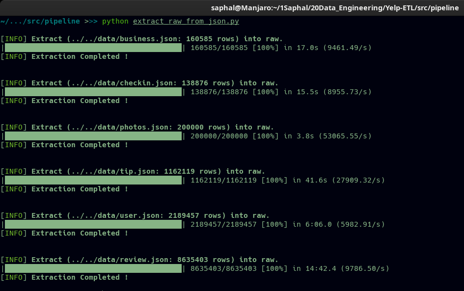

**Before explaining ETL process, lets see the utility modules in [../src/pipeline/utils/](../src/pipeline/utils) first.**


## 1. [database_connection.py](../src/pipeline/utils/database_connection.py)  file:  
This module helps us to connect to Postgresql Database as well as disconnect from the database easiy.

* a. The `databaseConnect()` function helps us to connect to database taking user,password,host,port and database variables from environment variable.
```
def databaseConnect():
    """
    This function helps to connect to postgresql database.
    """
    try:
        return psycopg2.connect(
            user=os.environ.get('DATABASE_USER'),
            password=os.environ.get('DATABASE_PASSWORD'),
            host=os.environ.get('HOST'),
            port=os.environ.get('PORT_NUMBER'),
            database=os.environ.get('DATABASE_NAME')
        )
    except Exception as e:
        print(f'{FAILURE}[-] Exception Occured:{END}', e)

```
* b. The `databaseDisconnect()` function helps to disconnect furthur connection from database taking `connection` and  `cursor` as parameters.

```
def databaseDisconnect(connection, cursor):
    """
    This function helps to disconnect from database.
    """
    try:
        connection.close()
        cursor.close()
    except Exception as e:
        print(f'{FAILURE}[-] Exception Occured:{END}', e)
```


## 2. [file_content_toString.py](../src/pipeline/utils/file_content_toString.py)  file:  
This module helps to get content of file as string datatype. Since we use different queries and procedures in ETL process, we have to execute the content in those sql file by passing the content of those file as string to `psycopg2` library. 

```
def file_content_toString(file_path):
    """
    This function provides content of files as string.
    param: file_path: Location of file whose content is needed as string.
    """
    try:
        with open(file_path, 'r') as file:
            content = "".join(file.readlines())
        return content
    except Exception as e:
        print(f'{FAILURE}[-] Exception Occured:{END}', e)
```
The function helps to read the content of file and returns all the content as string datatype.


## 3. [utils.py](../src/pipeline/utils/utils.py)  file:
This file is created to declare global variables which is used regularly in each scripts. 

```
"""
Necessary global variables.
"""
SUCCESS = "\33[92m"
FAILURE = "\33[91m"
BOLD = "\33[1m"
END = "\33[0m"
```
These are the characters used while printing statements in console in colorful formats accordingly.

**These modules are used in ETL scripts by importing them.**

<hr>

# Extract: 
The first process in ETL is Extraction.

Here we extract data from `.json` to raw_tables.
There are six `.json` files Yelp Datasets i.e business, checkin, user, review, tip and photos data. We extract these files into respective `raw_tables` using the script below.

## 1. [extract_raw_from_json.py](../src/pipeline/extract_raw_from_json.py) :

#### i. Imported necessary libraries:
```
import json
import subprocess
from utils.utils import *
from utils.database_connection import *
from utils.file_content_toString import *
from psycopg2.extras import execute_batch
from alive_progress import alive_bar
from dotenv import load_dotenv

load_dotenv()
BATCH_SIZE = 100000
```
Here `json` library helps us to read and parse json. `subprocess` helps to execute shell command in python. `utils` module as a utility import. `execute_batch` to execute the sql commands in batch. `alive_progress_bar` helps to analyze the time taken to extract the json into raw_tables. `dotenv` helps to import environment sensitive variables/credentials i.e Database informations. `BATCH_SIZE` is a global variable to execute sql command when batch size is met.

#### ii. Function Defination 
I defined the `extract_raw_from_json(table_name, file_path, query_path):` function which takes `table_name` , `file_path` , `query_path`  as arguments.
* `table_name `: Name of raw_table to extract json file. 
* `file_path` : File path of json file.
* `query_path` : Sql file path to execute to insert into raw_tables.

```
        def extract_raw_from_json(table_name, file_path, query_path):
         """
         This function extracts json file into raw_tables, 
         :param table_name: The name of table to extract json. 
         :param file_path: The json file path. 
         :param query_path: The sql query path to help insert into the table.
         """
```
> #### Let me explain what this function does.

Fist of all, it connects to required database. Then we define cursor to implement queries later.
```
        con = databaseConnect()
        cur = con.cursor()
```

Now count number of rows from json file to estimate time to extract.
```
        cmd = f'cat {file_path} | wc -l'
        completion = subprocess.check_output(cmd, shell=True)
        print(f"\n[{SUCCESS}INFO{END}] {BOLD}Extract ({file_path}: {int(completion)} rows) into raw.{END}")

```


```
        # Empty table before extraction
        cur.execute(f'TRUNCATE TABLE {table_name};')

        # Get content of query_path as string
        extract_query = file_content_toString(query_path)

        # Extract with temp_table to handle nested json
        if table_name == 'raw_business':
            subprocess.Popen(
                f'psql {os.getenv("DATABASE_USER") } -h {os.getenv("HOST")} -d {os.getenv("DATABASE_NAME")} -f {query_path}', 
                  shell=True)

        else:
            i = 0
            filtered_data = []

            # Read json file and batch insert data.
            with open(file_path, 'r', encoding='utf8') as json_file:
                with alive_bar(int(completion)) as bar:
                    for line in (json_file):
                        data = []
                        data.append(json.loads(line))
                        data = [[str(value) for value in item.values()]
                                for item in data]
                        filtered_data.append(data[0])
                        bar()

                        if i == BATCH_SIZE:
                            execute_batch(cur, extract_query, filtered_data)
                            con.commit()
                            filtered_data = []
                            i = 0
                            continue
                        i += 1

            # Extract remaining data if less than batch size.
            if len(filtered_data) != 0:
                execute_batch(cur, extract_query, filtered_data)
                con.commit()
```
Here I first checked if table_name if `raw_business` because it contained nested json. So, I extracted it using temporary table and mapping it to raw table using shell command of postgres i.e `psql`.

Then I extracted other files to correct raw_tables by reading the content of lines and batch ineserting it using `execute_batch`. 


#### iii. Function call with correct parameters:

Finally we call this funcion providing the correct `table_name`, `json file_path` and `sql query_path` to execute. 


```
if __name__ == '__main__':
    extract_raw_from_json('raw_checkin', '../../data/checkin.json','../sql/queries/extract_raw_checkin.sql')
    extract_raw_from_json('raw_business', '../../data/business.json','../sql/queries/extract_raw_business.sql')
    ...
```
And the json data was extracted to respective `raw_tables` !

The `query_path` is respective sql file path listed under [../src/sql/queries/](../src/sql/queries/) folder. 


**The console output after running the extracting seems like this:**



<hr>

# Transform :
The second process in ETL is Transformation.

Data extracted into raw_tables are now transformed into standard tables.

## 2. [transformation.py](../src/pipeline/transformation.py) :

#### i. Imported necessary libraries:
```
import time 
from utils.utils import *
from utils.database_connection import *
from utils.file_content_toString import *
```
Here `time` library helps us to calculate the elapsed time for each transformation and `utils` module as a utility import. 

#### ii. Function Defination 
I defined the `transform_raw_tables(transform_procedure):` function which takes `transform_procedure` as argument.
* `transform_procedure `: Sql file path to execure stored transform procedure. 

```
       def transform_raw_tables(transform_procedure):
       """
       This function transfoms raw_tables into standard tables.  
       :param transform_procedure: The sql procedure path to help transform into standard tables. 
       """
```
> #### Let me explain what this function does.

Fist of all, it reads the content of sql file path as string.
Then `time` library helps to calculate elapsed time of execution of this sql query.

```
    def transform_raw_tables(transform_procedure):
    """
    This function transfoms raw_tables into standard tables.  
    :param transform_procedure: The sql procedure path to help transform into standard tables. 
    """
    try:
        table_name = transform_procedure.split('/')[3].replace('.sql','').replace('transform_','')
        transformation_sql = file_content_toString(transform_procedure)
        print(f'\n[{SUCCESS}Info{END}] {BOLD}Transforming into {table_name} table...{END}')
        start_time = time.time()
        cur.execute(transformation_sql)
        con.commit()
        print(f'[{SUCCESS}INFO{END}] {BOLD}Transformation Successful!{END}')
        print(f'{SUCCESS}[+] Elapsed Time: {(time.time() - start_time):.4f} seconds.{END}')
    except Exception as e:
        print(f'{FAILURE}[-] Exception Occured:{END}',e)

```
Since the stored procedure queries are provided as `transform_procedure` file path, it executes and helps to transform raw data into respective standart tables. 


#### iii. Function call with correct parameters:

Finally we call this funcion providing the correct `transform_procedure` file path. 

```
if __name__ == '__main__':
    transform_raw_tables('../sql/procedures/transform_std_business.sql')
    transform_raw_tables('../sql/procedures/transform_std_photos.sql')
    transform_raw_tables('../sql/procedures/transform_std_user.sql')
    ...
```
And the raw_tables ares now extracted to `std_tables`!

The `transform_procedure` is respective sql file path listed under [../src/sql/procedures/](../src/sql/procedures/) folder. 


**The console output after running the extracting seems like this:**


<hr>

# Load :
The last process in ETL is Load.

Data extracted into standard tables are now loaded into correct dimensions and facts.

## 3. [load.py](../src/pipeline/load.py) :

#### i. Imported necessary libraries:
```
import time 
from utils.utils import *
from utils.database_connection import *
from utils.file_content_toString import *
```
Here `time` library helps us to calculate the elapsed time for each transformation and `utils` module as a utility import. 

#### ii. Function Defination 
I defined the `def load_tables(load_procedure):` function which takes `load_procedure` as argument.
* `load_procedure `: Sql file path to execure stored load procedure. 

```
       def load_tables(load_procedure):
    """
    This function loads std_tables into dimensions and facts.  
    :param load_procedure: The sql procedure path to help transform into fact and dimension tables. 
    """
```
> #### Let me explain what this function does.

Fist of all, it reads the content of sql file path as string.
Then `time` library helps to calculate elapsed time of execution of this sql query.

```
    def load_tables(load_procedure):
    """
    This function loads std_tables into dimensions and facts.  
    :param load_procedure: The sql procedure path to help transform into fact and dimension tables. 
    """
    try:
        table_name = load_procedure.split('/')[3].replace('.sql','').replace('load_','')
        transformation_sql = file_content_toString(load_procedure)
        print(f'\n[{SUCCESS}Info{END}] {BOLD}Loading into {table_name} table...{END}')
        start_time = time.time()
        cur.execute(transformation_sql)
        con.commit()
        print(f'[{SUCCESS}INFO{END}] {BOLD}Load Successful!{END}')
        print(f'{SUCCESS}[+] Elapsed Time: {(time.time() - start_time):.4f} seconds.{END}')
    except Exception as e:
        print(f'{FAILURE}[-] Exception Occured:{END}',e)

```
Since the stored procedure queries are provided as `load_procedure` file path, it executes and helps to transform stamdard tables into respective fact and dimension tables. 


#### iii. Function call with correct parameters:

Finally we call this funcion providing the correct `load_procedure` file path. 

```
if __name__ == '__main__':
    load_tables('../sql/procedures/load_fact_business.sql')
    load_tables('../sql/procedures/load_fact_user.sql')
    load_tables('../sql/procedures/load_dim_elite_years.sql')
    ...
```
And the raw_tables ares now extracted to correct `fact_tables` and `dim_tables`!

The `load_procedure` is respective sql file path listed under [../src/sql/procedures/](../src/sql/procedures/) folder. 


**The console output after running the extracting seems like this:**


<hr>

## Data Validations: 

**1.Check if business has no category**
```
SELECT COUNT(*) as total_impacted_count,
	CASE WHEN COUNT(*)> 0 then 'failed'
	   ELSE 'passed'
	   END as test_status
FROM std_business 
WHERE categories ='{}'
```


**1. Check if business has no category**
```
SELECT COUNT(*) as total_impacted_count,
	CASE WHEN COUNT(*)> 0 then 'failed'
	   ELSE 'passed'
	   END as test_status
FROM std_business 
WHERE categories ='{}'
```


**2. Check whether business hours are not correct**
```
SELECT COUNT(*) as total_impacted_count,
	CASE WHEN COUNT(*)> 0 then 'failed'
	   ELSE 'passed'
	   END as test_status
FROM std_business 
WHERE hours_sun_from < '0:0' or hours_sun_from > '24:0' or 
hours_sun_to < '0:0' or hours_sun_to > '24:0' or 
  hours_mon_from < '0:0' or hours_mon_from> '24:0' or 
  hours_mon_to < '0:0' or hours_mon_to > '24:0'or 
  hours_tues_from < '0:0' or hours_tues_from > '24:0'or
  hours_tues_to < '0:0' or hours_tues_to > '24:0'or
  hours_wed_from < '0:0' or hours_wed_from > '24:0'or
  hours_wed_to < '0:0' or hours_wed_to > '24:0'or
  hours_thurs_from < '0:0' or hours_thurs_from > '24:0'or
  hours_thurs_to < '0:0' or hours_thurs_to > '24:0'or
  hours_fri_from < '0:0' or hours_fri_from > '24:0' or 
  hours_fri_to < '0:0' or hours_fri_to > '24:0' or 
  hours_sat_from < '0:0' or hours_sat_from > '24:0' or 
  hours_sat_to < '0:0' or hours_sat_to > '24:0';
```


**3. Check if stars between 0 and 5 or not**
```
SELECT COUNT(*) as total_impacted_count,
	CASE WHEN COUNT(*)> 0 then 'failed'
	   ELSE 'passed'
	   END as test_status
FROM std_business
WHERE stars not between 0 and 5;
```


**4.  Date checks if it is more than present:**
**a. Review**
```
 SELECT COUNT(*) as total_impacted_count,
	CASE WHEN COUNT(*)> 0 then 'failed'
	   ELSE 'passed'
	   END as test_status
FROM std_review 
WHERE date > now();
```

**b. Tip**
```
SELECT COUNT(*) as total_impacted_count,
	CASE WHEN COUNT(*)> 0 then 'failed'
	   ELSE 'passed'
	   END as test_status
FROM std_tip 
WHERE date > now();
```


And the data seemed preety much valid through test cases. 